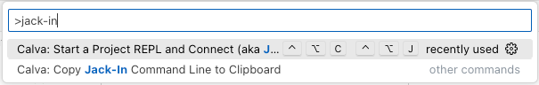
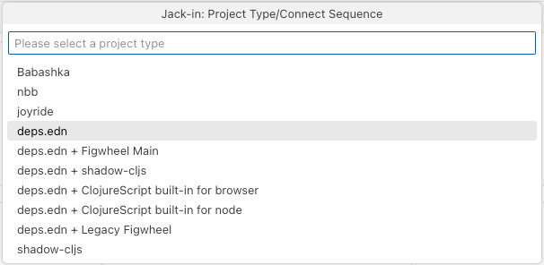
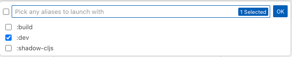
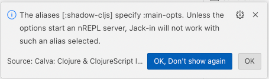

- 1. Open project folder in VSCode
- 2. Issue the VS Code command: `Calva: Start a Project REPL and Connect (aka Jack-in)`
	- 
- 3. choose `deps.edn`. **Do NOT** choose any option related to `shadow-cljs`!! Electric apps must run the shadow compiler inside the same JVM as the Clojure REPL. I'm not sure what those other calva options do, we do not recommend you use them!
	- 
- 4. choose `dev` alias and click `ok`
	- 
	- ```
	  ; Jacking in...
	  ; Connecting using "deps.edn" project type.
	  clj꞉user꞉>  ; Use `alt+enter` to evaluate
	  ; Jack-in done.
	  ```
- 5. run `(main)` to start
	- ```
	  clj꞉user꞉> 
	  (main)
	  Starting Electric compiler and server...
	  shadow-cljs - server version: 2.20.1 running at http://localhost:9630
	  shadow-cljs - nREPL server started on port 9001
	  
	  👉 App server available at http://0.0.0.0:8080
	  
	  true
	  ; [:dev] Configuring build.
	  ; 
	  ; [:dev] Compiling ...
	  ; 
	  ; [:dev] Build completed. (904 files, 1 compiled, 0 warnings, 6.90s)
	  clj꞉user꞉> 
	  ```
- If you see the following message, it is safe to ignore:
	- 