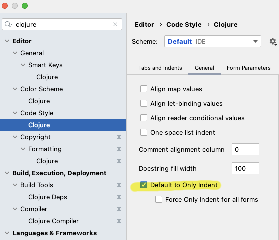
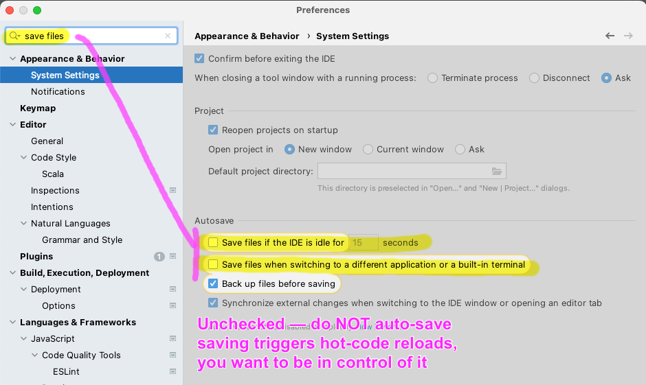

- new deps.edn project from existing sources
- Add Configuration
	- new Clojure REPL - local
		- Or, you can connect to the nrepl exported by shadow by running `clj -A:dev -X user/main`
	- run with Deps
		- Or, "run with IntelliJ project classpath" may work, let us know
	- aliases: `dev`
- Run configuration
- Indentation
	- {:height 487, :width 557}
- Disable auto-save
	- 
- Resolve symbols:
	- e/defn as defn
	- e/def as def
	- ... etc
	- Note: e/for-by does not have a corresponding intention in Cursive, options today are to live with the broken intellisense or disable it completely for e/for-by (which also disables intellisense in it's body)