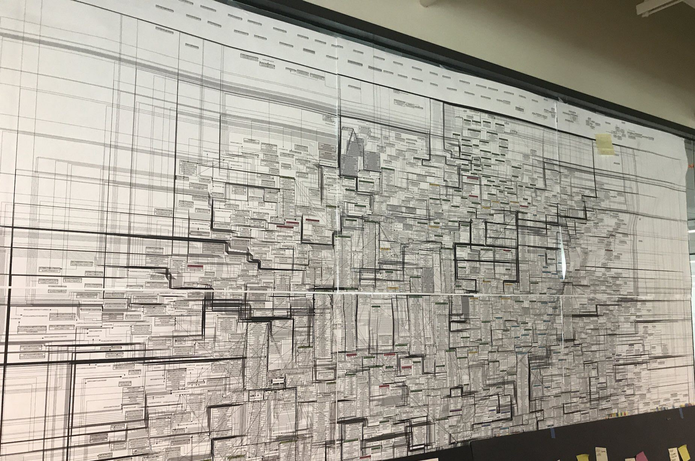

- Audience
	- Professional Clojure web developers - tool builders and infrastructure
- Key Takeaways
	- frontend/backend is a false dichotomy
	- really easy to start, its just clojure
		- https://github.com/hyperfiddle/electric-starter-app
	- Project maturity
		- already great at read-heavy visual apps
		- soon, interactive apps (complex forms, spreadsheets, webflow)
	- Network transparent composition enables fluent software
- Spine
	- Overview
		- Demos - to get oriented
		- Speedrun the basics
		- Q&A; deep explanations; discussion
		- "App as a Function"
	- Why we made Electric - 5 mins
		- more fluent tools are blocked on the frontend/backend chasm
		- Problem statement
			- "I have suffered greatly at the hands of REST, GraphQL and ORMs"
			- How can query and view compose directly, no framework?
			  collapsed:: true
				- ```clojure
				  (defn App [db] 
				    (dom/h1 "The result is: " 
				      (query-database db)))
				  ```
				- accidental complexity gone, cyclomatic complexity 1
				- frontend and backend should not be separated; that is an accident!
		- Past failures
		  collapsed:: true
			- State management: GraphQL, Falcor, Apollo, Posh & Datsys
			- App-builders: Retool, Notion, Bubble, Salesforce, Oracle Apex, Appian
			- Code IDEs: Glitch,
			- Graduation problem
				- 
				-
		- Solve this -> advance the state of the art
			- push out the frontier of what is **possible** (fluent tools, PKM, AI Native, etc)
			- pull in the frontier of what is **accessible** to someone with a bit of knowledge
		- Why now?
			- latency - <10ms to cloud by websocket
			- maturation of functional programming effect systems
			  collapsed:: true
				- cancellation of async processes
				- glitch free reactive propagation engines (FRP)
				- https://github.com/zio/zio – matured in 2020
				  collapsed:: true
					- positioned for commercial business programmers not PL researchers
					- abandons the haskell names
					- leverages java concurrency infrastructure under the hood
					- A+ documentation / marketing, conferences, social media
				- https://github.com/leonoel/missionary – launched in 2019, matured in 2022 (us)
				  collapsed:: true
					- unification of effects and FRP
					- cross-platform – clojure and clojurescript works the same way
				- [Electric Clojure reference list](https://gist.github.com/dustingetz/86178c39ecdd20c657f02a6d529520e1) – many important links from 2017-2019
- What is it
	- new paradigm for web development, competitive with React.js, GraphQL and Relay
	- For apps like this:
		- Partner app
			- 
			- *Screenshot: a partner-facing external application for a b2b startup at the Series A; we built what you see here in three weeks (which timeframe includes requirements extraction and live prod data connectivity, this is not a mock!)*
		- Data browser (compare to REBL)
			- 
		- Internal app
			- 
			- *Screenshot: the internal operations app we built for a Series B startup to operate their mission-critical customer success function that supports 10k users; this internal app has ~20 pages and dozens of business operations.*
		- Internal app – HFQL DSL
			- 
		- HFQL live
			- 
		- GraphiQL Explorer
			- 
		- Generative AI DSLs
			- 
	- Not a framework. a language, embedded in Clojure
		- Maturity : We have [TodoMVC](https://electric-demo.fly.dev/(user.demo-todomvc!TodoMVC)) for example, and it's fullstack!
	- Hello World: https://electric.hyperfiddle.net/
- How it works
	- Compiler-managed network
		- network management built into the language runtime
		- -> watch UIs are streaming DAGs
- Electric speedrun
	- Two Clocks
		- e/defn
		- reactive evaluation
		- e/client e/server
		- streaming lexical scope
		- clojure interop
	- Chat
		- e/for-by
		- Pending
		- cljs interop
		- multiplayer
	- https://github.com/hyperfiddle/electric-starter-app
	- [Explorer](https://electric-demo.fly.dev/(user.demo-explorer!DirectoryExplorer))
		- https://github.com/hyperfiddle/electric/blob/9833e053aa2a12c1234d91c450fbf9f8ddec457b/src-docs/user/demo_explorer.cljc#L15
		- infinite scroll
		- render-cell
			- ::fs/modified
			- ::fs/kind
	- Datomic browser (localhost)
		- https://github.com/hyperfiddle/electric-datomic-browser
		- EntityDetail – schema/link, date formatting on txDetail (derived)
	- [Treeview](https://electric-demo.fly.dev/(user.demo-todomvc!TodoMVC)) (recursion)
	- Y Combinator
	- TodoMVC Composed
	- UI5
		- UI is a high frequency concurrency problem
	- Component lifecycle
- Issues
  collapsed:: true
	- no hiccup syntax yet
	- compile times - no incremental builds yet – in design
	- stream-in rendering is visible and undesired - will fix
	- page shuts down on disconnect - will fix
	- optimistic updates for interactive apps - in design
- FAQ
  collapsed:: true
	- Multiplayer
	- global scope is global – shared server memory
	  collapsed:: true
		- optimistic updates are coming, can be done in userland
	- Auth
	- page http request retained in dynamic scope, see example
	- Efficiency
	- Signals and streams
	- React/Reagent/Fulcro interop
	- Relationship with Missionary
	- UI is a concurrency problem
		- backpressure
		- latency
		- resource management
		- concurrent events
	- Missionary
		- a vocabulary for concurrency and backpressure
		- to learn missionary is to learn backpressure
	- Deployment
	- Databases
	- Scaling
	- Electric UI
	- HFQL
	- [Electric Architecture](https://gist.github.com/dustingetz/a68b4b19b2818f51b46d8111966b8c7b)